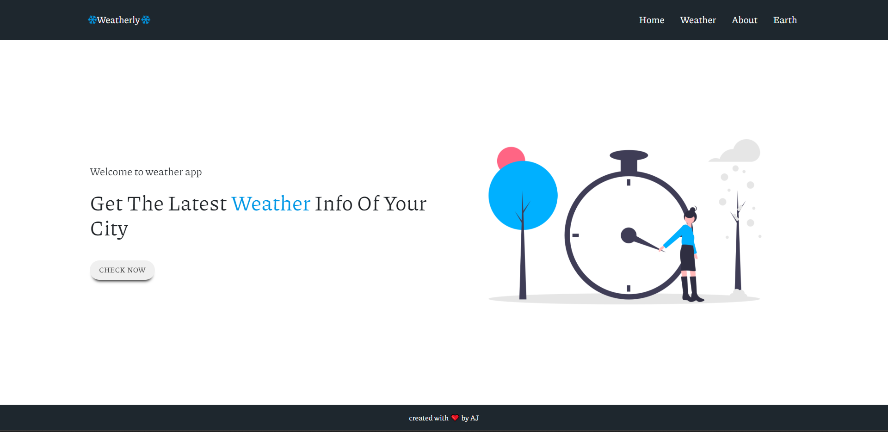
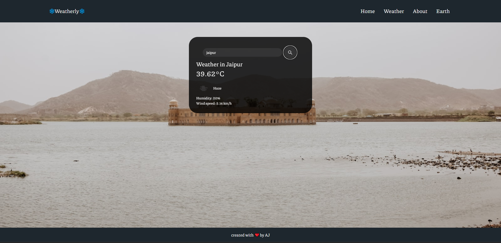
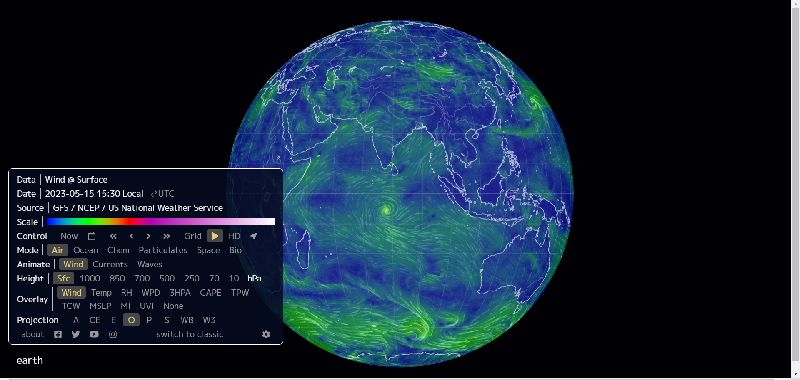

# Weatherly 
### A weather app build in expressJs using handlebars as a template engine.
<br><br>

  
  

<p  align="center">



</p>

## Features
* Weather page- get yoy know the current humidity, temperature and wind speed .
 <p  align="center">




</p>
<br>

## Earth page- Beautiful website by blueyesnet. Get you know about the weather of any place aroound the Earth just by placing cursor on the place on globe.
*<p  align="center">


</p>
<br>

## Prerequisites

Required to install and run the software:

-   [npm](https://www.npmjs.com/get-npm)

## Installing and Running
From the project folder, run these commands in console (terminal) to install dependencies and run the app:
```
npm install
node src/index.js
```
Open [http://localhost:3000](http://localhost:3000/) with your browser to see the result.


